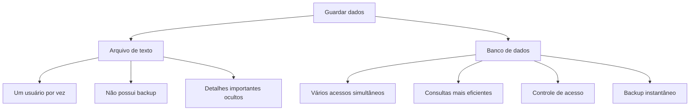
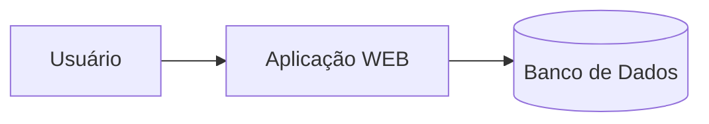
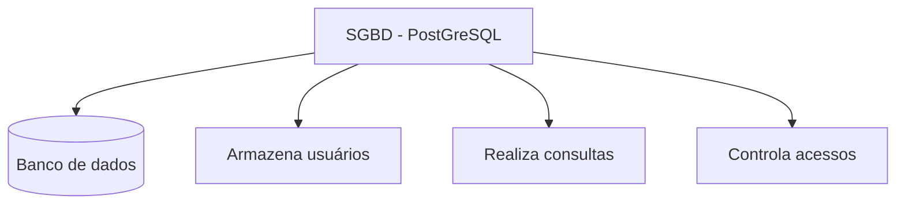

## Servidor de Desenvolvimento
Será uma interface de desenvolvimento, utilizada para projetar aplicações e banco de dados.


---
## Servidor de Arquivos Educacional
É um servidor para armazenar arquivos e facilitar na hora de realizar a transferência.
>O endereço para acesso ao servidor de arquivos é: `\\10.87.36.10`

>Credenciais de acesso: `Email: "aluno"`; `Senha: "aluno"`

---
## Servidor Pessoal
O Moba será a interface para acesso ao meu servidor de desenvolvimento.
>O acesso será realizado via SSH.

>Credenciais de acesso: `IP -> 192.168.10.97`; `Username -> root`; `Porta -> 2222`

Para o primeiro acesso, utilizamos a senha: `"aluno01"`.
Para alterar a senha, utilizamos o comando:
```bash
passwd
```

Para visualização do uso de recursos, utilizamos o comando:
```bash
htop
```

---
## Recursos e Configurações
|Recurso|Configuração|
|-------|------------|
|Processador|2 cores|
|RAM|512 MB|
|Armazenamento|6 GB|
|Sistema Operacional|Ubuntu 26.04 LTS|

---
## Objetivos Esperados
A utilização de um servidor de desenvolvimento, simula um ambiente real de produção.
Os objetivos esperados são:
- Deploy de projetos;
- Aplicação de banco de dados;
- Experiência real de mercado.

---
## BANCO DE DADOS
Antigamente, os dados eram salvos em arquivos/planilhas.


---
>Mas afinal, onde entra o Banco de Dados em aplicações WEB? 🤔


---
## SGBD
Sistema Gerenciador de Banco de Dados.

>Função: Gerenciar, controlar e permitir consultas nos nossos bancos de dados.

