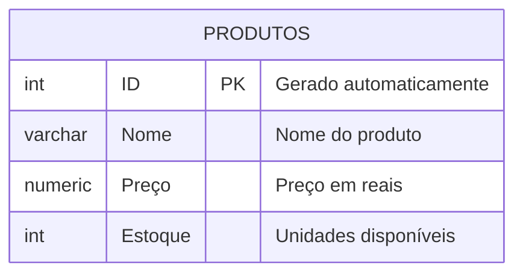

## AULA 04
Comando para criar um banco de dados:

```sql
CREATE DATABASE loja;
```

Comando para apagar um banco de dados:

```sql
DROP DATABASE lojamax;
```

---
O objetivo é criar uma loja para aprender os principais comandos SQL.



---
Para criar a tabela, utilizamos os comandos abaixo:

```sql
CREATE TABLE produtos(
    id INT GENERATED ALWAYS AS IDENTITY PRIMARY KEY,
    nome VARCHAR (50) NOT NULL,
    preco NUMERIC(10,2) NOT NULL,
    estoque INT NOT NULL DEFAULT 0
);
```
