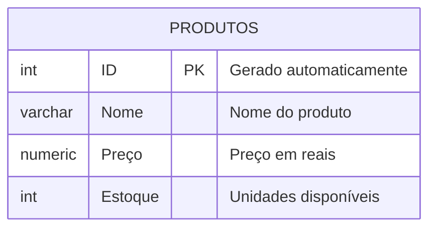
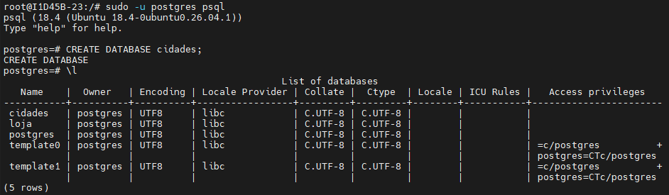
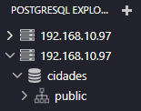
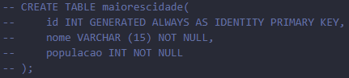
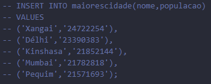
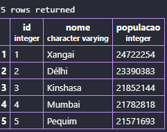

## AULA 04
Comando para criar um banco de dados:
```sql
CREATE DATABASE loja;
```

Comando para apagar um banco de dados:
```sql
DROP DATABASE lojamax;
```

---
O objetivo é criar uma loja para aprender os principais comandos SQL.



---
Para criar a tabela em SQL, utilizamos os comandos abaixo:
```sql
CREATE TABLE produtos(
    id INT GENERATED ALWAYS AS IDENTITY PRIMARY KEY,
    nome VARCHAR (50) NOT NULL,
    preco NUMERIC(10,2) NOT NULL,
    estoque INT NOT NULL DEFAULT 0
);
```

---
Para inserir dados na tabela, utilizamos os comandos:
```sql
INSERT INTO produtos (nome,preco,estoque)
VALUES ('Iphone 17','10000.00','15');
```

---
Para consultar todos os dados, utilizamos os comandos:
```sql
SELECT * FROM produtos
```


## Criação e Edição do Primeiro Banco de Dados!!
>1- No Moba, devemos entrar no **Postgres** com o comando `"sudo -u postgres psql"` e digitar `"CREATE DATABASE cidades;"` para criar o banco de dados:


(Utilizar o `\l` para verificar se o banco de dados foi criado)

>2- No VSCode, entrar na extenção **PostgreSQL** e abrir seu banco de dados ("cidades"):



>3- No seu banco de dados, clicar em **New Query** e criar a tabela (`"maiorescidade"`), e as colunas (id, nome, populacao), utilizando os seguintes comandos:

```sql
CREATE TABLE maiorescidade(
     id INT GENERATED ALWAYS AS IDENTITY PRIMARY KEY,
     nome VARCHAR (15) NOT NULL,
     populacao INT NOT NULL
 );
```


>4- Para inserir os registros das 5 maiores cidades do mundo, utilizar os comandos:

```sql
INSERT INTO maiorescidade(nome,populacao)
VALUES 
('Xangai','24722254'),
('Délhi','23390383'),
('Kinshasa','21852144'),
('Mumbai','21782818'),
('Pequim','21571693');
```


>5- Para consultar os registros, utilizamos o comando:
```sql
SELECT * FROM maiorescidade
```


>6- Por fim, utilizamos `"CTRL + ;"` para comentar os códigos (--) e clicamos em `F5` para rodar.


>7- A tabela ficará assim:

