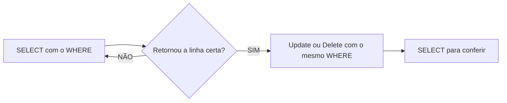

## AULA 05
Para filtrar colunas, utilizamos o comando:
```sql
SELECT populacao FROM maiorescidade;
```
---
Para filtrar registros, utilizamos o comando:
```sql
SELECT * FROM maiorescidade WHERE populacao < 22000000;
```
OU
```sql
SELECT * FROM maiorescidade WHERE nome = 'Xangai';
```
---
Para ordenar os dados, utilizamos o comando:
```sql
SELECT nome,populacao FROM maiorescidade
ORDER BY populacao DESC;
```
---
> ***UPDATE:*** Update ou Delete sem `WHERE` atinge TODAS as linhas!!! (Não existe CTRL + Z).

- ***Fluxo seguro (sempre):***

---
Também é possível realizar cálculos:
```sql
UPDATE maiorescidade
SET populacao= populacao - 10000000
WHERE id = 1;
```
---
> ***DELETE:*** Update ou Delete sem `WHERE` atinge TODAS as linhas!!! (Não existe CTRL + Z).

Para deletar registros:
```sql
DELETE FROM maiorescidade WHERE nome = 'Xangai';
```