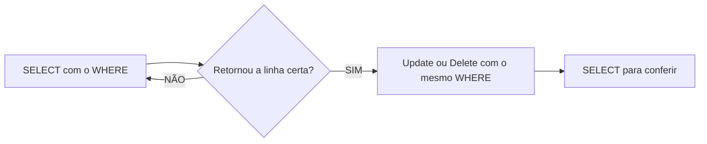
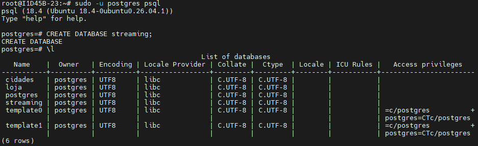
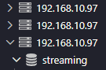
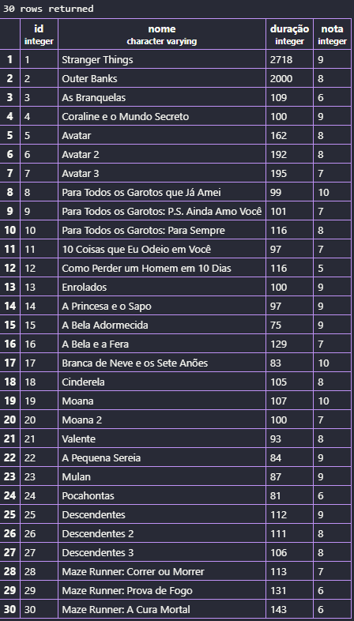
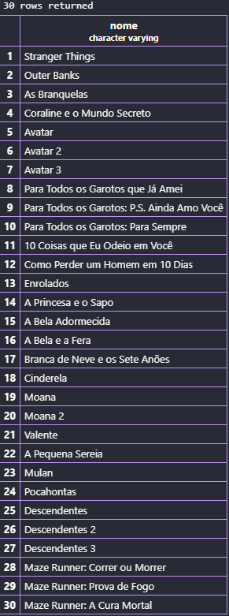
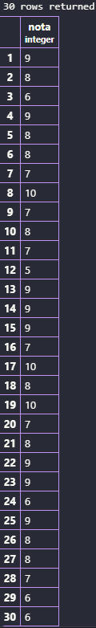

## AULA 05
Para filtrar colunas, utilizamos o comando:
```sql
SELECT populacao FROM maiorescidade;
```
---
Para filtrar registros, utilizamos o comando:
```sql
SELECT * FROM maiorescidade WHERE populacao < 22000000;
```
OU
```sql
SELECT * FROM maiorescidade WHERE nome = 'Xangai';
```
---
Para ordenar os dados, utilizamos o comando:
```sql
SELECT nome,populacao FROM maiorescidade
ORDER BY populacao DESC;
```
---
> ***UPDATE:*** Update ou Delete sem `WHERE` atinge TODAS as linhas!!! (Não existe CTRL + Z).

- ***Fluxo seguro (sempre):***

---
Também é possível realizar cálculos:
```sql
UPDATE maiorescidade
SET populacao= populacao - 10000000
WHERE id = 1;
```
---
> ***DELETE:*** Update ou Delete sem `WHERE` atinge TODAS as linhas!!! (Não existe CTRL + Z).

Para deletar registros:
```sql
DELETE FROM maiorescidade WHERE nome = 'Xangai';
```
---
## Criação do Banco de Dados STREAMING
>1- No Moba, devemos entrar no Postgres com o comando `"sudo -u postgres psql"` e digitar `"CREATE DATABASE streaming;"` para criar o banco de dados:




>2- No VSCode, entrar na extenção ***PostgreSQL*** e abrir o banco de dados (***"streaming"***):




>3- No banco de dados, clicar em **New Query** e criar a tabela (***"streaming"***), e as colunas (id, nome, duração, nota), utilizando os seguintes comandos:
```sql
CREATE TABLE streaming(
    id INT GENERATED ALWAYS AS IDENTITY PRIMARY KEY,
    nome VARCHAR (50) NOT NULL,
    duração INT NOT NULL,
    nota INT NOT NULL
);
```

>4- Para inserir os registros dos 30 filmes e séries, utilizar os comandos:
```sql
INSERT INTO streaming(nome, duração, nota)
VALUES 
('Stranger Things','2718','9'),
('Outer Banks','2000','8'),
('As Branquelas','109','6'),
('Coraline e o Mundo Secreto','100','9'),
('Avatar','162','8'),
('Avatar 2','192','8'),
('Avatar 3','195','7'),
('Para Todos os Garotos que Já Amei','99','10'),
('Para Todos os Garotos: P.S. Ainda Amo Você','101','7'),
('Para Todos os Garotos: Para Sempre','116','8'),
('10 Coisas que Eu Odeio em Você','97','7'),
('Como Perder um Homem em 10 Dias','116','5'),
('Enrolados','100','9'),
('A Princesa e o Sapo','97','9'),
('A Bela Adormecida','75','9'),
('A Bela e a Fera','129','7'),
('Branca de Neve e os Sete Anões','83','10'),
('Cinderela','105','8'),
('Moana','107','10'),
('Moana 2','100','7'),
('Valente','93','8'),
('A Pequena Sereia','84','9'),
('Mulan','87','9'),
('Pocahontas','81','6'),
('Descendentes','112','9'),
('Descendentes 2','111','8'),
('Descendentes 3','106','8'),
('Maze Runner: Correr ou Morrer','113','7'),
('Maze Runner: Prova de Fogo','131','6'),
('Maze Runner: A Cura Mortal','143','6');
```

>5- Para consultar os registros, utilizar o comando:
```sql
SELECT * FROM streaming;
```

>6- A tabela ficará assim:



>7- Para consultar somente o ***nome*** e ***nota*** dos filmes, utilizar os comandos:
```sql
SELECT nome FROM streaming;
SELECT nota FROM streaming;
```

-

---