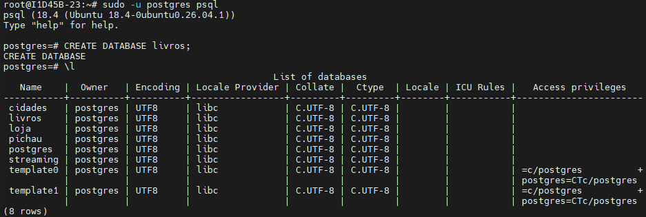
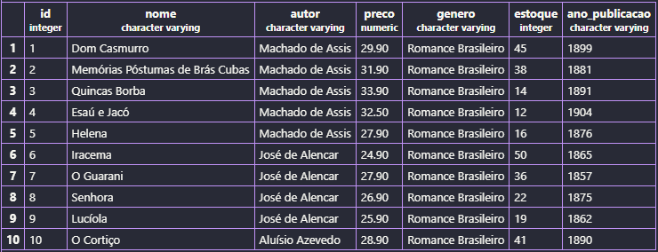
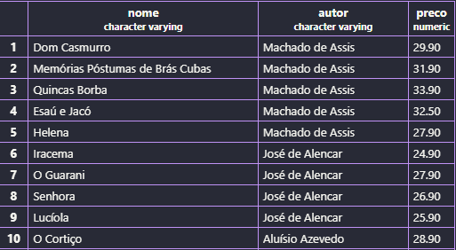
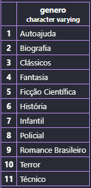
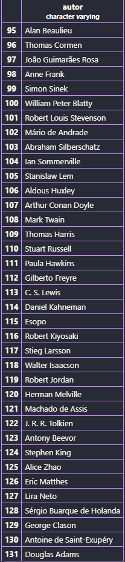
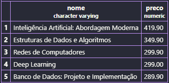
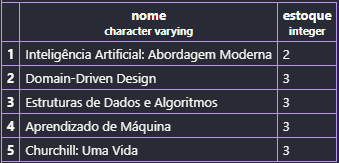

## AULA 06 - Análise de Dados
> Para verificar se um banco de dados existe antes de apagá-lo, utilizamos o comando:
```sql
DROP DATABASE IF EXISTS loja
```
---
> Criamos o banco de dados `pichau`:
```sql
CREATE DATABASE pichau;
```
---
> Para criar a tabela:
```sql
CREATE TABLE produtos(
    id SERIAL PRIMARY KEY,
    nome VARCHAR (100) NOT NULL,
    categoria VARCHAR (50) NOT NULL,
    preco DECIMAL(10,2) NOT NULL,
    estoque INTEGER NOT NULL
);
```
---
> Para inserir os dados:
```sql
INSERT INTO produtos (nome, categoria, preco, estoque) VALUES
('Mouse Óptico USB', 'Periféricos', 50.00, 120),
('Mouse Sem Fio', 'Periféricos', 89.90, 85),
('Mouse Gamer RGB', 'Periféricos', 249.00, 32),
('Teclado ABNT2 USB', 'Periféricos', 120.00, 64),
('Teclado Mecânico Gamer', 'Periféricos', 459.00, 18),
('Teclado Sem Fio Slim', 'Periféricos', 199.00, 40),
('Mousepad Grande', 'Periféricos', 45.00, 150),
('Suporte Ergonômico Notebook', 'Periféricos', 135.00, 28),
('Hub USB 4 Portas', 'Periféricos', 79.00, 95),
('Adaptador USB-C HDMI', 'Periféricos', 159.00, 47),

('Monitor 21,5 Full HD', 'Monitores', 750.00, 22),
('Monitor 24 Full HD IPS', 'Monitores', 950.00, 19),
('Monitor 27 QHD', 'Monitores', 1890.00, 8),
('Monitor 32 4K', 'Monitores', 2790.00, 4),
('Monitor Gamer 144Hz', 'Monitores', 1650.00, 11),
('Suporte Articulado Monitor', 'Monitores', 289.00, 26),

('Notebook Básico 8GB', 'Notebooks', 2890.00, 14),
('Notebook Intermediário 16GB', 'Notebooks', 4500.00, 9),
('Notebook Gamer RTX', 'Notebooks', 7990.00, 3),
('Notebook Ultrafino 14', 'Notebooks', 5300.00, 6),
('Chromebook 11', 'Notebooks', 1790.00, 17),
('Carregador Universal 65W', 'Notebooks', 189.00, 58),

('Impressora Laser Mono', 'Impressão', 800.00, 12),
('Impressora Multifuncional', 'Impressão', 1250.00, 7),
('Impressora Tanque de Tinta', 'Impressão', 1090.00, 10),
('Toner Compatível Preto', 'Impressão', 145.00, 72),
('Cartucho Colorido', 'Impressão', 98.00, 88),
('Papel A4 500 folhas', 'Impressão', 29.90, 240),
('Scanner de Mesa', 'Impressão', 690.00, 5),

('Roteador Wi-Fi 5 Dual Band', 'Redes', 249.00, 35),
('Roteador Wi-Fi 6 AX1500', 'Redes', 459.00, 16),
('Switch 8 Portas Gigabit', 'Redes', 329.00, 21),
('Cabo de Rede Cat6 5m', 'Redes', 35.00, 180),
('Repetidor de Sinal Wi-Fi', 'Redes', 139.00, 54),
('Placa de Rede USB Wi-Fi', 'Redes', 89.00, 66),
('Nobreak 1500VA', 'Redes', 980.00, 6),

('SSD 480GB SATA', 'Armazenamento', 289.00, 45),
('SSD 1TB NVMe', 'Armazenamento', 549.00, 24),
('SSD 2TB NVMe', 'Armazenamento',1090.00, 9),
('HD Externo 1TB', 'Armazenamento', 379.00, 31),
('HD Externo 2TB', 'Armazenamento', 549.00, 15),
('Pen Drive 64GB', 'Armazenamento', 49.90, 200),
('Pen Drive 128GB', 'Armazenamento', 79.90, 110),
('Cartão de Memória 128GB', 'Armazenamento', 99.00, 76),

('Headset Gamer com Microfone', 'Áudio', 250.00, 38),
('Headset Bluetooth', 'Áudio', 329.00, 27),
('Caixa de Som Bluetooth', 'Áudio', 189.00, 49),
('Fone Intra-Auricular', 'Áudio', 69.90, 130),
('Microfone Condensador USB', 'Áudio', 449.00, 13),
('Webcam Full HD 1080p', 'Áudio', 180.00, 41);
```
---
> Para verificar a quantidade de linhas da tabela:
```sql
SELECT COUNT(*) FROM produtos;
```
---
> Filtro de colunas e limitação de saídas:
```sql
SELECT nome, preco FROM produtos LIMIT 10;
```
---
> Para verificar a quantidade e tipos diferentes de categorias:
```sql
SELECT DISTINCT categoria FROM produtos ORDER BY categoria;
```
- `ORDER BY` serve para organizar os dados em ordem alfabética.
---
> Filtro de colunas e categorias (filtro combinado):
```sql
SELECT nome,preco,estoque
FROM produtos
WHERE categoria = 'Monitores';
```
---
> Filtrando produtos que custam mais do que R$1000,00:
```sql
SELECT nome, preco
FROM produtos
WHERE preco <= 1000;
```
---
> Para faixas de preços:
```sql
SELECT nome,preco
FROM produtos
WHERE preco >= 0 AND preco <= 500;
```
OU
```sql
SELECT nome,preco
FROM produtos
WHERE preco BETWEEN 0 AND 500;
```
---
> Utilizando o comando `OR` para filtrar duas categorias:
```sql
SELECT nome, preco
FROM produtos
WHERE categoria = 'Monitores' OR categoria = 'Notebooks';
```
---
> Para consultas desconsiderando letras maiúsculas:
```sql
SELECT nome, preco
FROM produtos
WHERE nome ILIKE 'monitor%';
```
- `nome ILIKE 'monitor%'`: Compara o campo ***nome*** de forma **case-insensitive** (sem diferenciar maiúsculas de minúsculas). O símbolo `%` no final significa "qualquer texto após a palavra monitor".
---
## Atividade prática 06 - Análise de Dados (Livraria)
>Criação do banco de dados `livros`:



>Criação da tabela e colunas:
```sql
CREATE TABLE livros(
    id INT GENERATED ALWAYS AS IDENTITY PRIMARY KEY,
    nome VARCHAR (50) NOT NULL,
    autor VARCHAR (50) NOT NULL,
    preco DECIMAL (10,2) NOT NULL,
    genero VARCHAR (50) NOT NULL,
    estoque INT NOT NULL,
    ano_publicacao VARCHAR (4) NOT NULL
);
```
---
>**Bloco 1** - Reconhecimento da base

>1. Exiba todos os dados da tabela, mas limitando o resultado aos 10 primeiros registros.
```sql
SELECT * FROM livros LIMIT 10;
```



>2. Exiba apenas as colunas nome, autor e preco de todos os livros.
```sql
SELECT nome,autor,preco FROM livros;
```



>3. Liste os gêneros distintos existentes na base, em ordem alfabética.
```sql
SELECT DISTINCT genero FROM livros ORDER BY genero;
```



>4. Descubra quantos autores diferentes existem.
```sql
SELECT DISTINCT autor FROM livros;
```



>5. Liste os 5 livros mais caros da base (nome e preço).
```sql
SELECT nome,preco FROM livros
ORDER BY preco DESC
LIMIT 5;
```



>6. Liste os 5 livros com menor estoque (nome e estoque).
```sql
SELECT nome,estoque FROM livros
ORDER BY estoque ASC
LIMIT 5;
```


>**Bloco 2** - Filtros numéricos

>7. Mostre nome e estoque de todos os livros do gênero Técnico.