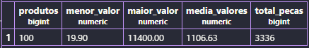

## AULA 07 - Análise de Dados (Funções)

> Para *contar* o número total de linhas presentes na tabela:

- `AS` cria um apelido para a coluna do resultado.
```sql
SELECT COUNT(*) AS total_produtos
FROM produtos;
```

> Para *contar* quantos produtos possuem estoque maior que 10:
```sql
SELECT COUNT(*) AS total_produtos
FROM produtos
WHERE estoque > 10;
```

> Para mostrar o *maior* e o *menor* preço dos produtos cadastrados:
```sql
SELECT
    MAX (preco) AS produto_mais_caro,
    MIN (preco) AS produto_mais_barato
FROM produtos;
```

> Para calcular o preço médio (***média***) de todos os produtos cadastrados:
```sql
SELECT AVG (preco) FROM produtos;
```

> Para calcular o preço médio dos produtos e arredondar o resultado para 2 casas decimais (***média arredondada***):
```sql
SELECT ROUND (AVG (preco),2) AS preco_medio
FROM produtos;
```

> Para *somar* a quantidade de estoque de todos os produtos cadastrados:
```sql
SELECT SUM (estoque) AS total_produtos
FROM produtos;
```

> Para mostrar um resumo geral dos produtos, calculando a quantidade de produtos, o menor preço, o maior preço, o preço médio e o total de peças em estoque:
```sql
SELECT
    COUNT(*) AS produtos,
    MIN (preco) AS menor_valor,
    MAX (preco) AS maior_valor,
    ROUND (AVG(preco),2) AS media_valores,
    SUM (estoque) AS total_pecas
    FROM produtos;
```


> Para mostrar o nome, preço e estoque de cada produto, calcular o valor total do estoque de cada produto (`preco * estoque`) e ordenar do maior para o menor valor:
```sql
SELECT nome,
preco,
estoque,
preco * estoque AS total_estoque
FROM produtos
ORDER BY total_estoque DESC;
```

> Para calcular o valor total de todos os produtos em estoque, somando o preço de cada produto multiplicado pela quantidade disponível:
```sql
SELECT SUM (preco * estoque) AS patrimonio_total
FROM produtos;
```