## AULA 08 - Análise de Dados (Funções) - *Revisão, Aula 07*

- **Função de Contagem:**
`COUNT`

---
> Para *contar* a quantidade de linhas presentes na tabela:
```sql
SELECT COUNT(*) FROM produtos;
```

> Para *contar* e *renomear* a tabela:
```sql
SELECT COUNT(*) AS total_registros FROM produtos;
```

> Para *filtrar* quantos produtos da tabela estão com o estoque *igual* ou *abaixo* de 5:
```sql
SELECT COUNT(*) AS produtos_baixoestoque
FROM produtos
WHERE estoque <= 5;
```

> Para filtrar quantos produtos da tabela possuem a categoria **'Perifericos'**:
```sql
SELECT COUNT(*) AS total_perifericos
FROM produtos
WHERE categoria = 'Perifericos';
```

> Para exibir o produto de *maior valor*:
```sql
SELECT MAX (preco) AS produtos_maiorvalor
FROM produtos;
```

> Para *ordenar* os produtos da tabela do mais caro para o mais barato:
```sql
SELECT nome, preco FROM produtos
ORDER BY preco DESC;
```

> Para exibir o produto de *menor valor*:
```sql
SELECT MIN (preco) AS produtos_menorvalor
FROM produtos;
```

> Para calcular a *média* da coluna **'preco'**:
```sql
SELECT AVG (preco) AS media_precos
FROM produtos;
```

> Para calcular a *média* de "maneira correta" ***(arredondada)***:
```sql
SELECT ROUND (AVG (preco), 2) AS media_correta_precos
FROM produtos;
```

> Para exibir o *maior* e *menor* preço e calcular a *média* (correta/arredondada):
```sql
SELECT
    MAX (preco) AS maior_preco,
    MIN (preco) AS menor_preco,
    ROUND (AVG (preco), 2) AS media
FROM produtos;
```

> Para *somar* a quantidade de produtos presentes na tabela:
```sql
SELECT SUM (estoque) AS total_produtos
FROM produtos;
```

> Para realizar tudo que foi documentado anteriormente de uma só vez:
```sql
SELECT
    MAX (preco) AS maior_preco,
    MIN (preco) AS menor_preco,
    ROUND (AVG (preco), 2) AS media_precos,
    SUM (estoque) AS total_produtos
FROM produtos;
```
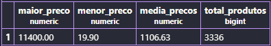

> Para *somar* o valor total de faturamento pela venda de todos os produtos:
```sql
SELECT SUM (preco * estoque) AS total_faturamento
FROM produtos;
```
---
---
## Atividade prática 07 - Análise de Dados

> **PARTE A — CONSULTAS E FILTROS**
>- A1. Liste o nome e o preço de todos os produtos da categoria Monitores.
```sql
SELECT nome, preco
FROM produtos
WHERE categoria = 'Monitores';
```
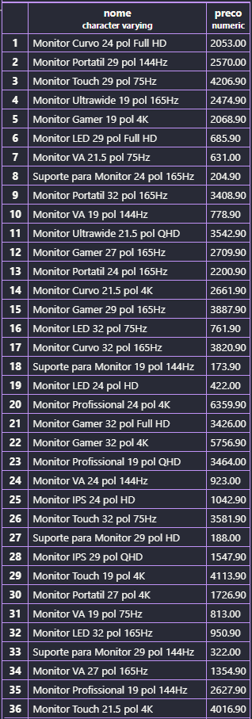

*(Exemplo acima de 36 produtos).*

---
>- A2. Liste todos os produtos com estoque menor que 5 unidades, mostrando nome, categoria e estoque.
```sql
SELECT nome, categoria, estoque
FROM produtos
WHERE estoque < 5;
```
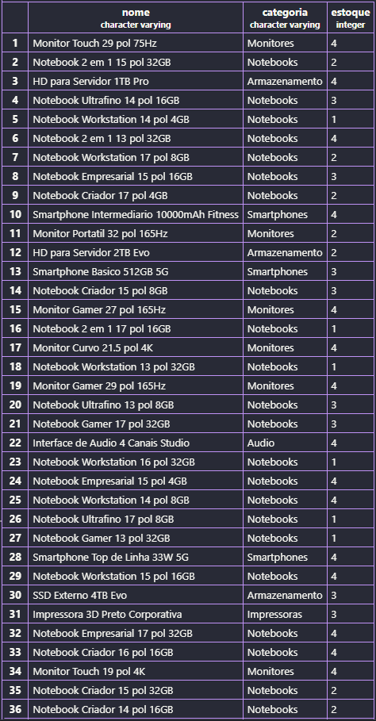

*(Exemplo acima de 36 produtos).*

---
>- A3. Liste os 10 produtos mais caros da loja (nome e preço), do mais caro para o mais barato.
```sql
SELECT nome, preco
FROM produtos
ORDER BY preco DESC
LIMIT 10;
```
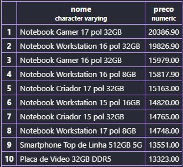

---
>- A4. Liste os produtos da marca Logitech, ordenados por preço crescente.
```sql
SELECT nome, preco FROM produtos
WHERE marca = 'Logitech'
ORDER BY preco ASC;
```
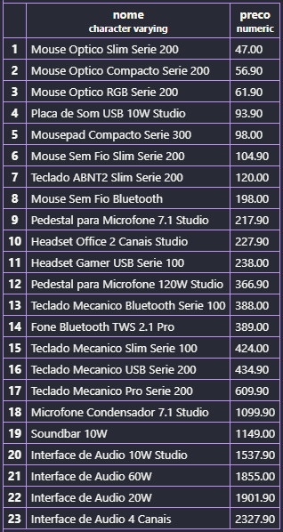

---
>- A5. Liste os produtos com preço entre R$ 100,00 e R$ 500,00, mostrando nome e preço.
```sql
SELECT nome, preco FROM produtos
WHERE preco BETWEEN 100 AND 500;
```
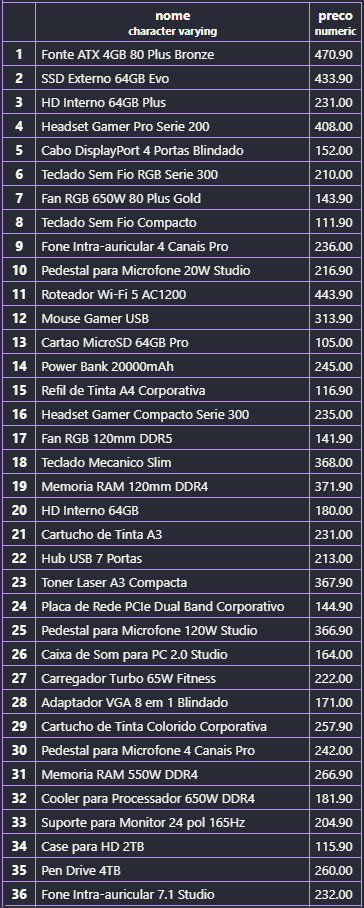

*(Exemplo acima de 36/327 produtos).*

---
> **PARTE B — FUNÇÕES DE AGREGAÇÃO**
>- B1. Quantos produtos existem cadastrados na loja? Dê ao resultado o nome total_de_produtos.
```sql
SELECT COUNT(*) AS total_de_produtos
FROM produtos;
```
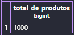

---
>- B2. Quantos produtos estão com estoque abaixo de 10 unidades? Nomeie a coluna como produtos_em_falta.
```sql
SELECT COUNT(*) AS produtos_em_falta
FROM produtos
WHERE estoque < 10;
```
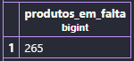

---
>- B3. Qual o maior e o menor preço da loja? Traga os dois na mesma consulta, com os nomes maior_preco e menor_preco.
```sql
SELECT
    MAX (preco) AS maior_preco,
    MIN (preco) AS menor_preco
FROM produtos;
```
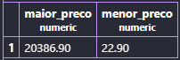

---
>- B4. Qual o preço médio dos produtos da categoria Notebooks, arredondado para 2 casas decimais?
```sql
SELECT ROUND (AVG (preco), 2) AS preco_medio
FROM produtos
WHERE categoria = 'Notebooks';
```
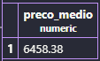

---
>- B5. Quantas peças a loja tem no total, somando o estoque de todos os produtos? Nomeie como total_de_pecas.
```sql
SELECT SUM (estoque) AS total_de_pecas
FROM produtos;
```
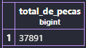

---
> **PARTE C — PAINEL E CÁLCULOS**
>- C1. Monte um painel resumo em uma única consulta, retornando de uma vez: quantidade de produtos, preço médio (2 casas decimais), maior preço, menor preço e total de peças em estoque. Todas as colunas devem ter nomes compreensíveis para o gerente.
```sql
SELECT
    COUNT(*) AS total_produtos,
    ROUND (AVG (preco), 2) AS preco_medio,
    MAX (preco) AS maior_preco,
    MIN (preco) AS menor_preco,
    SUM (estoque) AS total_de_pecas
FROM produtos;
```
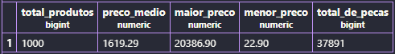

---
>- C2. O valor imobilizado de um produto não está gravado na tabela: ele precisa ser calculado (preço x estoque). Crie a coluna calculada valor_em_estoque e mostre os 5 produtos com maior valor imobilizado, exibindo nome, preço, estoque e o valor calculado.
```sql
SELECT nome, preco, estoque,
(preco * estoque) AS valor_em_estoque
FROM produtos
ORDER BY valor_em_estoque DESC
LIMIT 5;
```
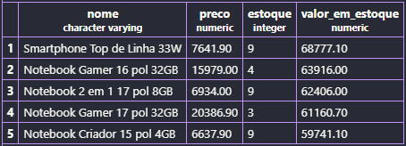

---
>- C3. Compare o resultado de C2 com o produto mais caro que apareceu em A3. É o mesmo item? Escreva duas linhas explicando o que essa comparação revela sobre o estoque da loja.

> ***Resposta:*** Não, são itens diferentes. Essa comparação revela que o valor total parado no estoque depende do preço e também da quantidade disponível, e não apenas do produto mais caro.