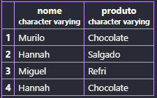
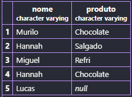
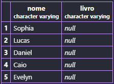

## Atividade prática 11 - Relacionamento entre tabelas

> **1** - Primeiro, criamos o banco de dados no Moba:



> **2** - Criamos a primeira tabela, chamada `alunos`:
```sql
CREATE TABLE alunos (
    id SERIAL PRIMARY KEY,
    nome VARCHAR(50) NOT NULL
);
```

> **3** - Criamos a segunda tabela, chamada `emprestimos`, referenciando com a coluna `id` da tabela `alunos`:
```sql
CREATE TABLE emprestimos (
    id SERIAL PRIMARY KEY,
    livro VARCHAR(50) NOT NULL,
    id_aluno INT REFERENCES alunos(id)
);
```

> **4** - Inserimos alunos na tabela `alunos`:
```sql
INSERT INTO alunos (nome) VALUES
('Mayne'),
('Pollyanna'),
('Julia'),
('Alice'),
('Felipe'),
('Miguel'),
('Murilo'),
('Gabriel'),
('Pietro'),
('Yasmin'),
('Sophia'),
('Lucas'),
('Caio'),
('Evelyn'),
('Daniel');
```

> **5** - Inserimos os livros e seus respectivos alunos na tabela `emprestimos`:
```sql
INSERT INTO emprestimos (livro, id_aluno) VALUES
('Dom Quixote', 1),
('Dom Casmurro', 2),
('Crime e Castigo', 3),
('1984', 4),
('Cem Anos de Solidão', 5),
('O Pequeno Príncipe', 6),
('A Metamorfose', 7),
('Vidas Secas', 8),
('A Hora da Estrela', 9),
('Capitães da Areia', 10);
```

> **6** - Dados da tabela `alunos`:
```sql
SELECT * FROM alunos;
```


>**7** - Dados da tabela `emprestimos`:
```sql
SELECT * FROM emprestimos;
```


> **8** - Para verificar quais os livros que cada aluno emprestou:
```sql
SELECT alunos.nome, emprestimos.livro
FROM emprestimos
INNER JOIN alunos ON emprestimos.id_aluno = alunos.id;
```


> Os alunos que não apareceram foram: *Sophia, Lucas, Caio, Evelyn e Daniel*, porque nenhum deles emprestou algum livro da biblioteca.

> **9** - Para verificar todos os alunos, até mesmo os que não emprestaram nenhum livro:
```sql
SELECT alunos.nome, emprestimos.livro
FROM alunos
LEFT JOIN emprestimos ON emprestimos.id_aluno = alunos.id;
```


> Apareceu: `null`.

> **10** - Alunos que nunca pegaram algum livro emprestado:
```sql
SELECT alunos.nome, emprestimos.livro
FROM alunos
LEFT JOIN emprestimos ON emprestimos.id_aluno = alunos.id
WHERE emprestimos.id IS NULL;
```


> **11** - Tentativa de registrar um empréstimo para o aluno 50:
```sql
INSERT INTO emprestimos (livro, id_aluno) VALUES ('Turma da Mônica', 50);
```
> *Mensagem:*


> Houve um erro. Isso aconteceu porque o *aluno 50* não está cadastrado na tabela `alunos`. O `id_aluno` precisa existir na tabela `alunos` para poder fazer o empréstimo.